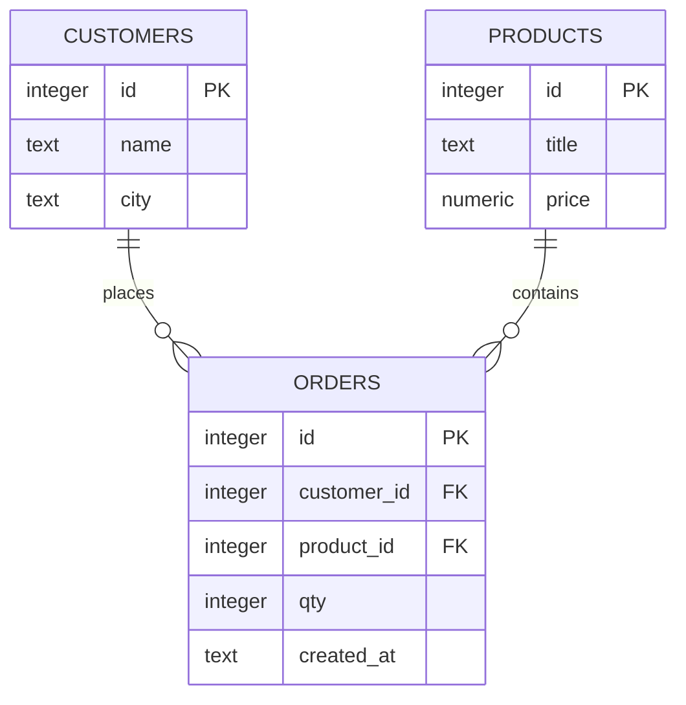

# ERD: student_shop

```mermaid
erDiagram
    CUSTOMERS ||--o{ ORDERS : places
    PRODUCTS ||--o{ ORDERS : contains

    CUSTOMERS {
        integer id PK
        text name
        text city
    }

    PRODUCTS {
        integer id PK
        text title
        numeric price
    }

    ORDERS {
        integer id PK
        integer customer_id FK
        integer product_id FK
        integer qty
        text created_at
    }
```

Связи:

- один покупатель может иметь много заказов;
- один товар может встречаться во многих заказах;
- строка `orders` хранит количество товара в конкретном заказе.
